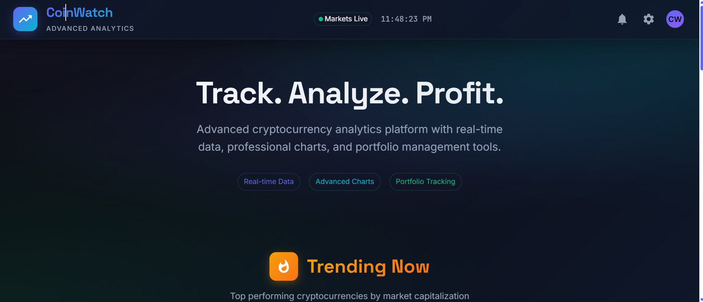
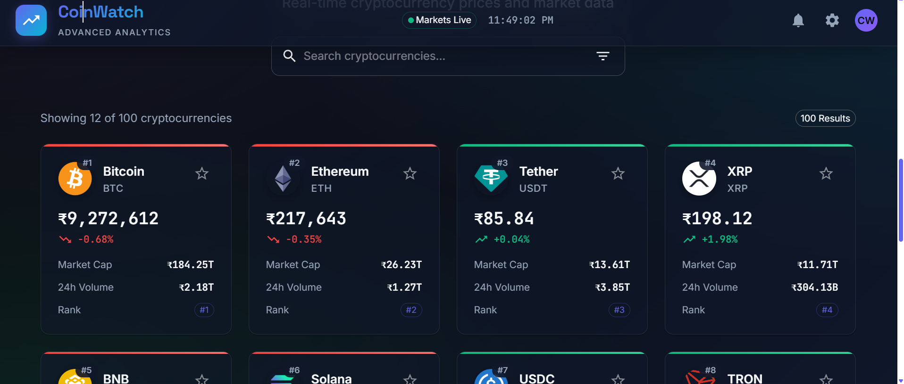
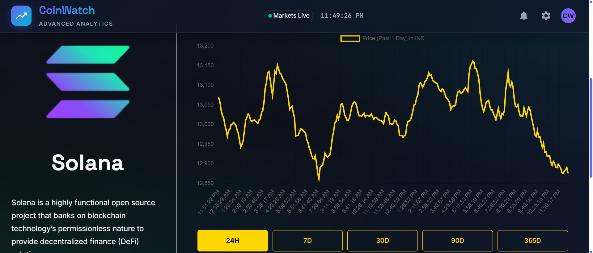

# � CoinWatch - Advanced Cryptocurrency Analytics Platform

<div align="center">


**CoinWatch** is a modern, elegant cryptocurrency tracking platform built with React and Material-UI. Experience real-time market data, professional charts, and advanced analytics in a beautifully designed glassmorphism interface.

[](https://reactjs.org/)
[](https://mui.com/)
[](https://chartjs.org/)


[🌐 Live Demo](https://crypto-coinwatch.netlify.app/) • [📖 Features](#-features) • [🚀 Installation](#-installation)

</div>

---

## ✨ Features

### 🎨 **Modern Design System**
- 🌑 **Glassmorphism UI** with backdrop blur effects and elegant transparency
- 🎯 **Professional Dark Theme** with sophisticated color palette
- 🌈 **Gradient Accents** throughout the interface for visual appeal
- 📱 **Fully Responsive** design optimized for all screen sizes
- ✨ **Smooth Animations** with cubic-bezier transitions

### 📊 **Advanced Analytics**
- 🔥 **Trending Carousel** showcasing top performing cryptocurrencies
- � **Real-time Price Tracking** for 1000+ digital assets
- 📊 **Interactive Charts** with Chart.js integration
- � **Market Statistics** including market cap, volume, and 24h changes
- 🎯 **Professional Number Formatting** with compact notation (K, M, B, T)

### 🔍 **Enhanced User Experience**
- 🔍 **Smart Search** with instant filtering capabilities
- ⭐ **Favorites System** with interactive star ratings
- � **Card-based Layout** replacing traditional table design
- 📄 **Advanced Pagination** with smooth scrolling
- 💀 **Loading Skeletons** for better perceived performance
- 🎪 **Detailed Coin Pages** with dynamic routing and comprehensive data

---

## 🔗 Live Demo

🌐 **Check it out here**: [Deployed website link](https://crypto-coinwatch.netlify.app/)  


---

## 📸 Screenshots

<div align="center">

### 🏠 **Hero Section**


### 📊 **Coin List & Analytics**
| Coin List Section | Graph Analytics Section |
|-------------------|-------------------------|
|  |  |

*Experience modern cryptocurrency tracking with our elegant card-based design and professional analytics interface.*

</div>

---

## 📦 Installation

1. **Clone the repository**:

   ```bash
   git clone https://github.com/rajromil/Crypto_Coin_Watch.git
   ```

2. **Install dependencies**:

   ```bash
   npm install
   ```

3. **Start the development server**:

   ```bash
   npm start
   ```

4. Open `http://localhost:3000` to view it in the browser.

---


## 🛠️ Tech Stack

<div align="center">

| **Frontend** | **Styling** | **Icons & Fonts** | **Charts** | **API & Data** |
|--------------|-------------|-------------------|------------|----------------|
|  |  |  |  |  |
|  |  |  |  |  |

</div>

### 🎯 **Key Technologies**
- **Frontend Framework**: React 18.2.0 with functional components and hooks
- **UI Library**: Material-UI (MUI) 5.13.0 for professional component design
- **Routing**: React Router DOM 6.23.0 for seamless navigation
- **Charts**: Chart.js 4.4.9 with React integration for data visualization
- **API**: CoinGecko API for real-time cryptocurrency data
- **State Management**: React Context API for global state
- **Styling**: Emotion CSS-in-JS with MUI theme customization
- **Carousel**: React Alice Carousel for trending coins display

---

## 🎨 Design Highlights

### **Modern Glassmorphism Interface**
- **Backdrop Blur Effects**: Elegant translucent components with blur(20px)
- **Gradient Accents**: Dynamic color transitions using modern CSS gradients
- **Professional Color Palette**: 
  - Primary: Indigo (`#6366f1`) for modern sophistication
  - Secondary: Cyan (`#06b6d4`) for fresh vibrancy
  - Success: Emerald (`#10b981`) for positive market changes
  - Error: Red (`#ef4444`) for negative market changes

### **Typography & Visual Elements**
- **Space Grotesk**: Modern geometric sans-serif for headers
- **Inter**: Highly legible font for body text and data
- **JetBrains Mono**: Professional monospace for prices and numbers
- **Custom Animations**: Smooth hover effects and loading states
- **Card-based Layout**: Modern card design replacing traditional tables

---


## 📝 API Reference

**CoinGecko API Integration**
- **Base URL**: `https://api.coingecko.com/api/v3/`
- **Rate Limit**: 50 calls/minute (free tier)
- **Documentation**: [CoinGecko API](https://www.coingecko.com/en/api)

### **Key Endpoints**
```javascript
// Market data for cryptocurrencies
GET /coins/markets?vs_currency=usd&order=market_cap_desc&per_page=100

// Detailed coin information
GET /coins/{id}

// Historical price data
GET /coins/{id}/market_chart?vs_currency=usd&days=7
```

---

## 👨‍💻 Author

<div align="center">
Romil Raj

[](https://github.com/rajromil)
[](mailto:rajromilk23@gmail.com)
[](https://www.linkedin.com/in/romil-raj-80983728a/)

*"Building modern web applications with cutting-edge technologies and beautiful user experiences."*

</div>

---

<div align="center">

**(https://github.com/rajromil)**

*CoinWatch - Track. Analyze. Profit.*

</div>
