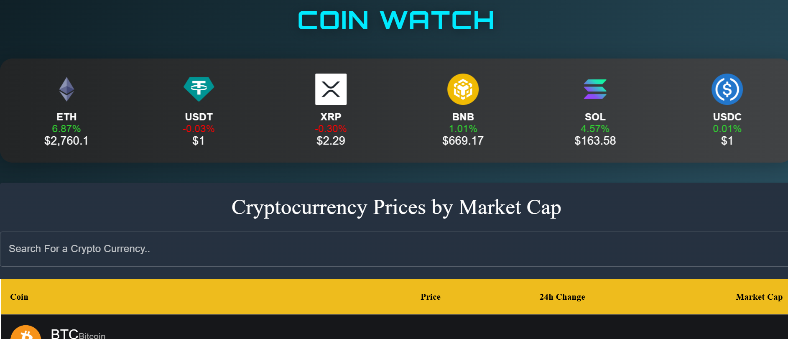
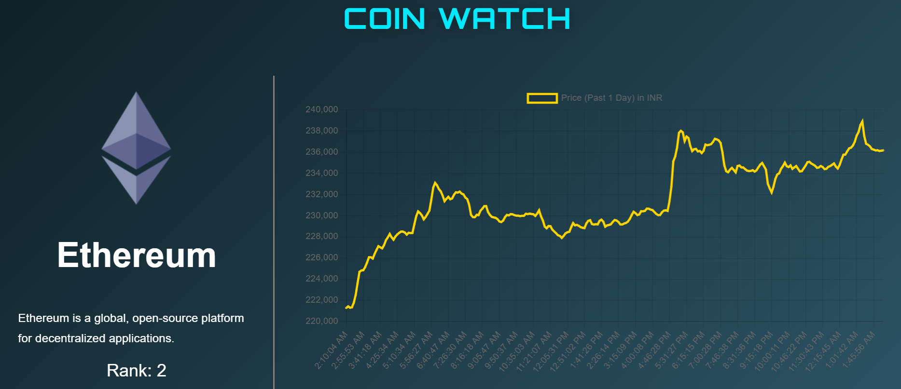

# 💰 Crypto Coin Watch

**Crypto Coin Watch** is a modern, responsive React-based web application that lets you monitor real-time cryptocurrency data. It features trending coins, price charts, and detailed statistics for individual coins — all wrapped in a clean, dark-themed UI.

---

## 🚀 Features

- 🌑 Dark theme with Material-UI
- 🔥 Trending cryptocurrency carousel
- 📊 Live price tracking for all major coins
- 🔍 Detailed coin pages with dynamic routing
- ⚡ Responsive and fast UI
- 🌐 Client-side routing with React Router
- 🧠 Context API for global state management

---

## 🔗 Live Demo

🌐 **Check it out here**: [https://your-deployed-site-link.com](https://crypto-coinwatch.netlify.app/)  


---

## 📸 Screenshots

_Add screenshots here once available. Example:_

| Homepage                          | Coin Detail Page                      |
|----------------------------------|----------------------------------------|
|     |    |

---

## 📦 Installation

1. **Clone the repository**:

   ```bash
   git clone https://github.com/yourusername/crypto_coin_watch.git
   cd crypto_coin_watch
   ```

2. **Install dependencies**:

   ```bash
   npm install
   ```

3. **Start the development server**:

   ```bash
   npm start
   ```

4. Open `http://localhost:3000` to view it in the browser.

---

## ☁️ Deployment

_You can deploy this app using platforms like Netlify, Vercel, or GitHub Pages._

### Example: Deploying on Vercel

1. Push your code to GitHub.
2. Go to [vercel.com](https://vercel.com) and import your repo.
3. Set build command: `npm run build`
4. Set output directory: `build`
5. Click **Deploy** — that’s it!

---

## 🛠️ Tech Stack

- **React.js**
- **Material-UI (MUI)**
- **React Router**
- **Context API**

---

## 👨‍💻 Author

**Romil Raj**  
📧 [rajromilk23@gmail.com](mailto:rajromilk23@gmail.com)

---

## 📄 License

This project is open source under the [MIT License](LICENSE).
